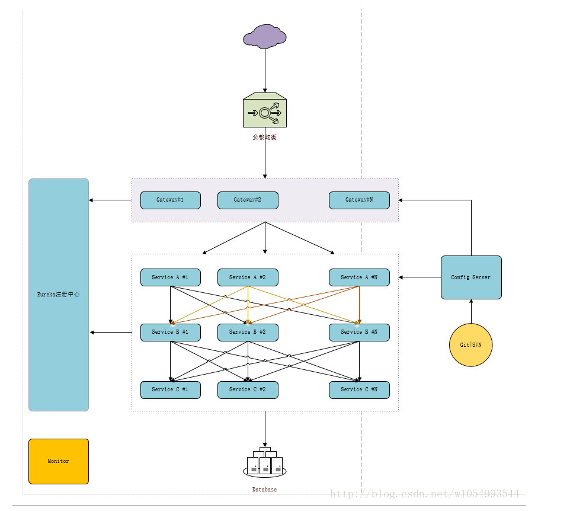
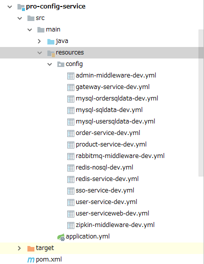
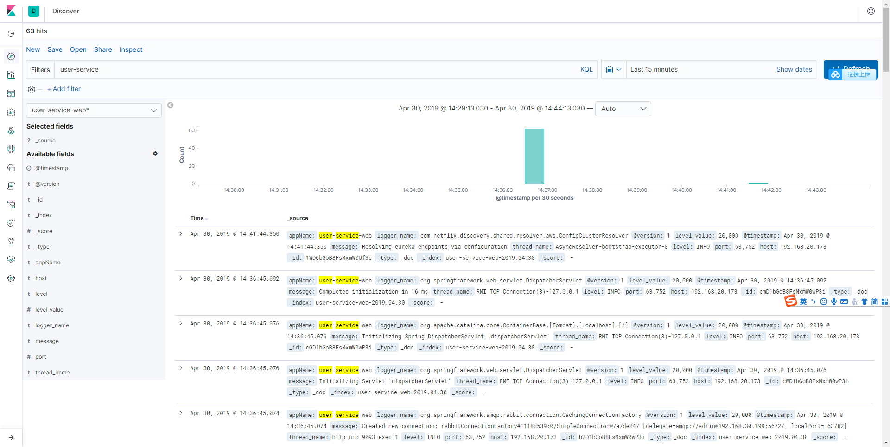

# spring-cloud 升级为 Greenwich.RELEASE spring boot 2.1.4
架构图 

 
(1) Eureka
 

  
(2) Actuator
 
(3) Feign Ribbon
 
(4) Swagger2
 
(5) Hystrix
 
(6) MyBatis druid
 
(7) Redis
 
(8) Zuul
 
(9) Sleuth zipkin rabbitmq mysql持久

 

 
(10) Admin
 

 

 
(11)Config Bus Rabbitmq (统一配置中心) 

 
(12)Gateway 代替zuul  实现了redis 限流 以及 熔断降级
 
(13)ELK 将spring boot logback收集来的日志上传到日志服务ELK
 
(14)TX-LCN分布式事务框架(参考pro-user-service-web) 
 
(15) 增加SSO 单点登录（正在整）
http://localhost:8083/oauth/token?client_id=android&client_secret=android&grant_type=password&username=admin&password=123456