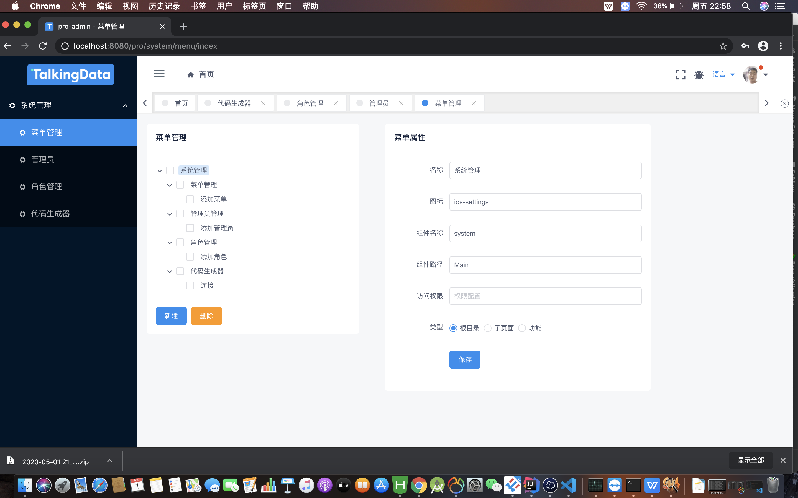
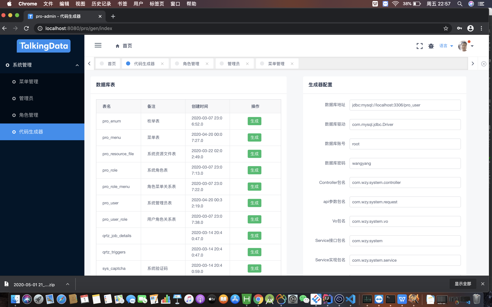
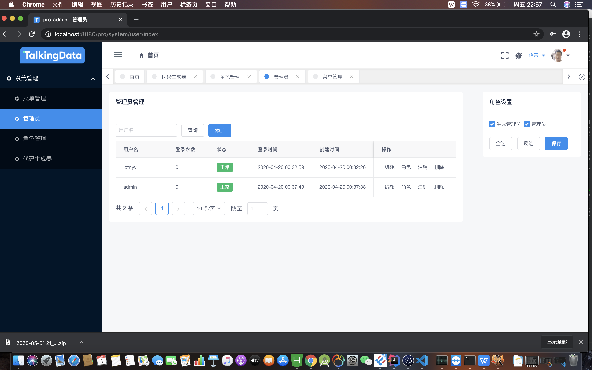
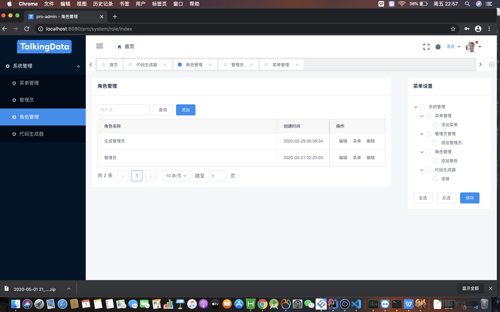
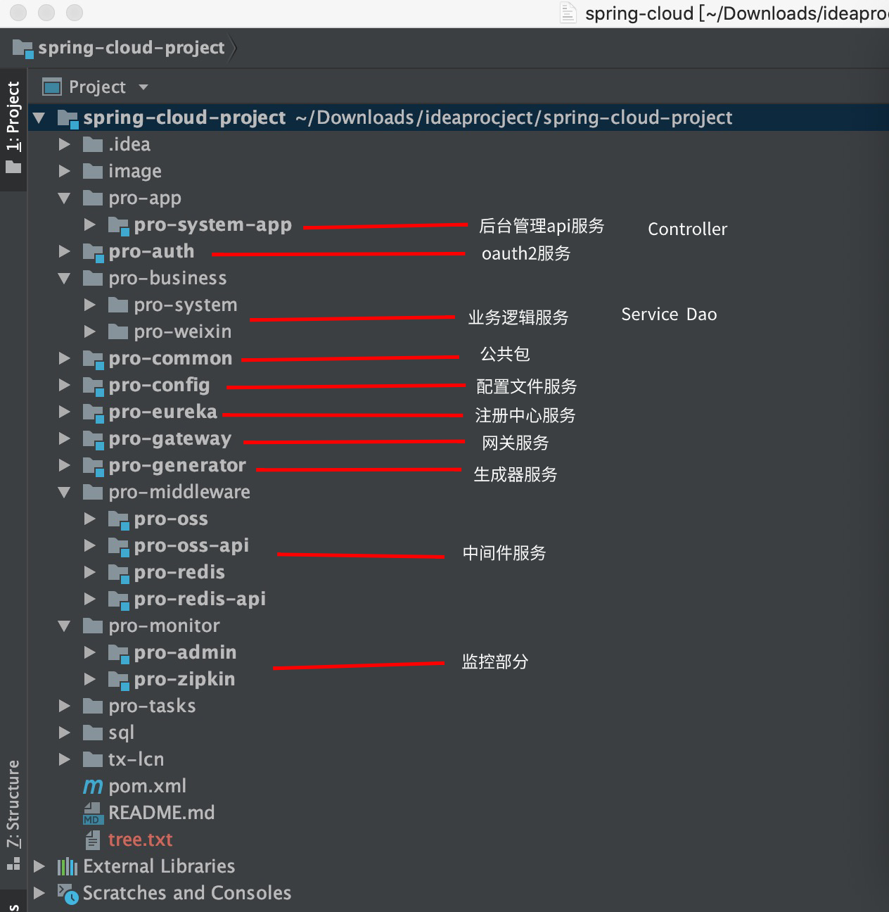

# 项目说明
#### 搭建的微服务脚手架，欢迎大家随便用,内置代码生成器，后台管理功能陆续完善中。
# 架构图  
   
# 项目源码
    Web管理端 https://gitee.com/lptnyy/spring-cloud-project-vue   
    Web管理端 https://github.com/lptnyy/spring-cloud-project-vue    
    后端服务 https://gitee.com/lptnyy/spring-cloud-project   
    后端服务 https://github.com/lptnyy/spring-cloud-project   
# 前端展示
   
   
   
 
# 后端项目结构 本仓库代码为后端
  
# 技术选型  
    核心框架 Spring Boot  
    核心框架 Spring cloud 全家桶  
    消息队列 RabbitMq  
    日志收集 LogBack ELK
    连接池 Druid + ShardingJdbc 读写分离  
    持久层框架 Mybatis Plus
    定时器 Quartz
    前端框架 vue3.0 IView  
    数据库 MySql
    缓存 Redis
    文件系统 阿里OSS 以及 本地储存 
    容器 Docker  
    监控 admin zipkin  
# 开发环境搭建
#### 安装虚拟机
    https://www.cnblogs.com/double-K/p/10952233.html  博客地址  
#### 安装docker
    https://www.cnblogs.com/straycats/p/10680502.html 博客地址  
#### 部署redis
    https://www.runoob.com/docker/docker-install-redis.html 博客地址 
#### 部署rabbitmq
    https://blog.csdn.net/myNameIssls/article/details/99702877 博客地址 
#### 部署mysql环境 
    https://www.cnblogs.com/sablier/p/11605606.html 博客地址 
#### 导入数据库脚本
    导入 sql 文件夹下的 3个 sql文件
#### 后端项目
    1 启动注册中心 pro-eureka工程 8001 idea启动环境变量配置 EUREKA-SERVICE=localhost
    2 启动配置中心 pro-config工程 8002 idea启动环境变量配置 EUREKA-SERVICE=localhost RABBIT_URL=localhost
    3 启动网关服务 pro-gateway工程 8101 idea启动环境变量配置 CONFIG-SERVICE=localhost spring.profiles.active=dev
    4 启动业务System服务 pro-system/pro-system-server工程 8008 idea启动环境变量配置 ZUUL-SERVICE=localhost spring.profiles.active=dev
    5 启动ApiSystem服务 pro-app/pro-system-app工程 8009  idea启动环境变量配置 ZUUL-SERVICE=localhost spring.profiles.active=dev
    6 启动Oauth2服务 pro-auth工程 8006 idea启动环境变量配置 ZUUL-SERVICE=localhost spring.profiles.active=dev
    7 OSS服务 pro-middleware/pro-oss工程 8007 idea启动环境变量配置 ZUUL-SERVICE=localhost spring.profiles.active=dev
    8 Redis服务 pro-middleware/pro-redis工程 8005 idea启动环境变量配置 ZUUL-SERVICE=localhost spring.profiles.active=dev
    9 Admin服务 pro-monitor/pro-admin工程 idea启动环境变量配置 ZUUL-SERVICE=localhost spring.profiles.active=dev
    10 Zipkin服务 pro-monitor/pro-zipkin工程 idea启动环境变量配置 ZUUL-SERVICE=localhost spring.profiles.active=dev  

#### 有需要搭建框架，搭建正式环境，测试环境，可以扫描二维码联系我，不是免费的（其他程序都可以）
 

# 框架QQ交流群  
  
